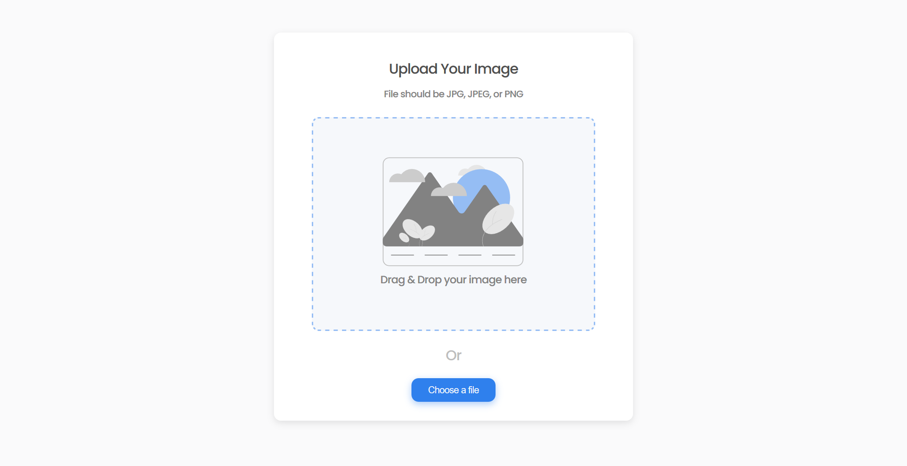

<h1 align="center">Image Uploader 🖼</h1>

[](https://app.netlify.com/sites/vue3-image-uploader/deploys)



Simple image uploader with drag & drop using `Vue.js 3`, `TypeScript` and `SCSS`. Check the backend repository [here](https://github.com/HotPotatoC/image-uploader-api).

## Demo

Check the demo [here](https://vue3-image-uploader.netlify.app/)

## Getting Started

Clone the repository then install the dependencies.

To start locally clone the [backend repository](https://github.com/HotPotatoC/image-uploader-api) then follow the README instructions.

create a .env.local file with the following content

```
VUE_APP_API_URL=http://localhost:5000
```

Starting the web app

```bash
# using npm
$ npm run serve

# using yarn
$ yarn serve
```
